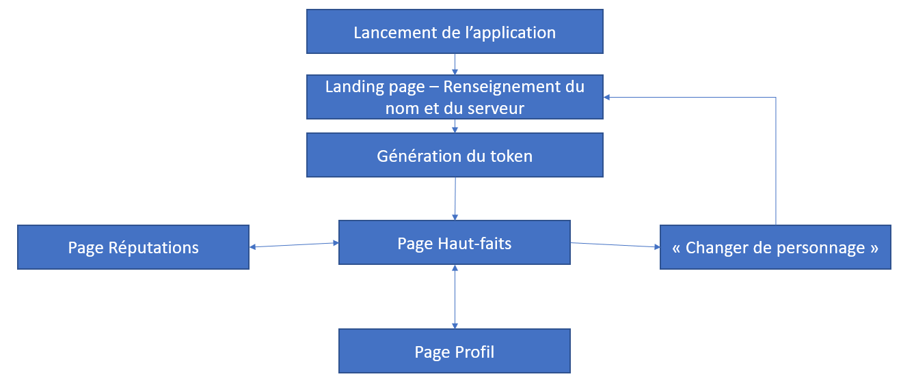
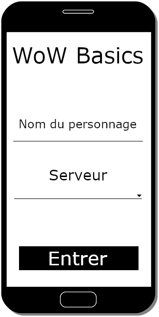
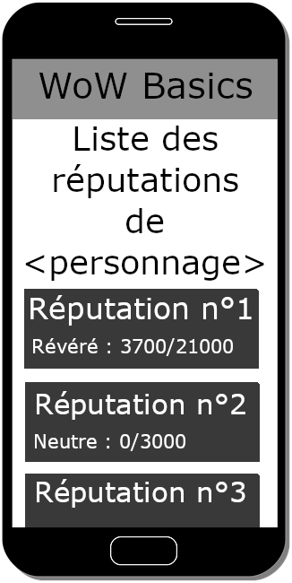
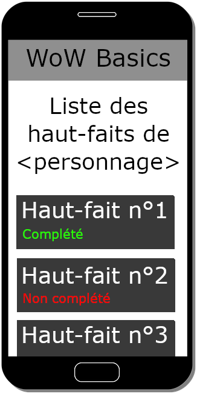
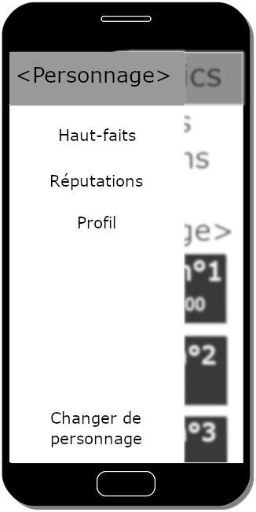

# WoW Basics - Phase de conception

La phase de conception aborde une méthode afin d'établir des maquettes pour la future application. On va dans un premier lieu réaliser quelques personas pour situer notre clientèle, puis de ces personas découleront quelques scénarios types. Nous verrons ensuite les tâches utilisateur que les deux parties précédentes auront démontré, pour pouvoir créer un arbre des tâches et enfin quelques maquettes.

## Personas

### Ismael

Ismaël, 22 ans, étudiant, est un joueur occasionnel de World of Warcraft qui fait évoluer son personnage à son rythme et souhaite savoir en temps réel l’avancée de son personnage sur certaines fonctionnalités du jeu sans être forcé à entrer dans les menus qu’il ne connait pas très bien ou qu’il n’arrive pas à lire facilement.

### Doryan

Doryan, 23 ans, étudiant, joue beaucoup à World of Warcraft et possède déjà plusieurs personnages au niveau maximum dans les différentes factions du jeu. Mais à chaque fois qu’il souhaite consulter des informations sur ses autres personnages, il doit se déconnecter du personnage en jeu pour se reconnecter sur le personnage souhaité, et cette opération prend parfois plusieurs minutes. Et Doryan en a marre de perdre du temps comme ça, et cherche un outil qui lui permette de vérifier ces informations rapidement et simplement sans avoir à se déconnecter tout le temps.

### Baptiste

Baptiste, 22 ans, étudiant, est un joueur expérimenté de World of Warcraft : Après quasiment 10 ans sur le jeu, Baptiste à acquéri un très grand nombre de haut-faits témoignant de sa longue expérience. Et il aime beaucoup partager cette expérience avec ses amis, puisqu’il en parle très souvent avec eux. Mais le problème, c’est qu’il ne peut pas tout le temps se connecter au jeu, puisqu’il n’a pas tout le temps son ordinateur sous la main. Il recherche donc une appli lui permettant de partager facilement son expérience de jeu avec ses amis. Un peu vantard comme garçon, non ?

## Scénarios

### C'est quelle touche pour accéder au menu?

Ismael et Doryan jouent ensemble, et Ismael doit monter l'une de ses réputations pour valider un haut-fait et débloquer une nouvelle fonctionnalité du jeu. Le problème, c'est qu'avec la profusion de manus disponibles en jeu, Ismael ne se souvient jamais de quelle touche ouvre quel menu. Après avoir cherché la touche pendant plusieurs longues minutes il finit par la trouver, mais ça l'exaspère de devoir chercher à chaque fois puisqu'il ne retient jamais cette information. Mais depuis qu'il a téléchargé WoW Basics, il lui suffit de quelques clics sur son téléphone pour trouver ce qu'il cherche. Plus besoin de s'embêter à explorer les menus, puisque son portable lui fournit ce dont il a besoin sans effort.

### J'ai pas envie de me déconnecter juste pour ça...

Doryan se connecte avec l'un de ses personnages et se rend sur une île en jeu afin d'acheter des objets permettant de monter sa réputation dans une faction. Le problème, c'est qu'l ne sait pas s'il doit utiliser ces objets avec ce personnage ou avec un autre, puisqu'il ne sait pas quel personnage a le plus haut niveau de réputation avec cette faction. Doryan possédant plusieurs personnages ayant accès à cette faction, et vu que chaque déconnexion prend 20 secondes car c'est la règle imposée par le jeu, il perdrait beaucoup de temps à vérifier chacun de ses personnages un par un via le jeu. Il allume alors WoW Basics, et explore les réputations de ses différents personnages pour trouver l'avatar avec lequel il n'aura pas besoin de trop dépenser de monnaie pour arriver à la fin de cette réputation. Grâce à WoW Basics, Doryan a mis environ 2 minutes à sonder les réputations de tous ses personnages, là où le faire en jeu lui en aurait sans doute pris une dizaine de minutes.

## Tâches utilisateur

Voici une liste des possibles tâches utilisateur :

- Renseigner nom & serveur du personnage
- Générer un jeton d'accès pour utiliser l'API
- Créer une page listant les haut-faits et s'ils sont accomplis ou non
- Créer une page listant les réputations et leur niveau
- Créer une page affichant la progression dans les donjons du personnage
- Créer une page pour le profil du personnage

## Arbre des tâches

## Maquettes

Et voici les maquettes de l'application :

